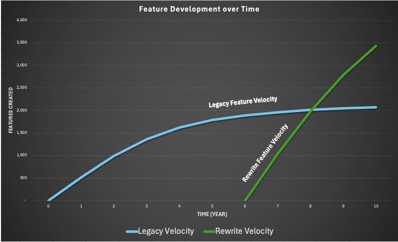
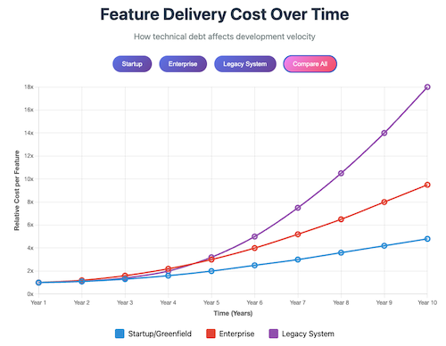

# Legacy Code and Technical Debt
## A model to help decide to refactor or rewrite

After years of passionate investment into an application, there comes a time when you will be challenged
to push on and refactor a problematic platform or to rewrite it.  This is a difficult and scary proposition.

Being an engineer, I wanted to create a model that could help with the decision process.  Included here
is a simple model you can take and modify to enhance your own analysis.  

Note, there are MANY intertwined factors that should influence your decision, and this analysis is only a small part.  
I provided some additional food for thought below.
Regarding this model's accuracy: It is limited.  I find the power in a model is not its accuracy or answer, but what the creation process does in understanding the issue and the sensitivity of various factors.

The Excell based model is here: [Rebuild-analysis-model.xlsx](Rebuild-analysis-model.xlsx)

### Development Velocity comparison for a rewrite

### Relative Costs of development over time
<a href="https://danjamk.github.io/app-rewrite-analysis/feature_cost_curve.html" target="_blank">Interactive Relative cost chart</a>

## Other Factors to consider
Here are more key factors to consider when deciding between rewriting vs. refactoring:

**Technical Factors**
- **Code maintainability** - How difficult is it to make changes, fix bugs, or add features to the current codebase?
- **Architecture limitations** - Does the current structure fundamentally prevent you from achieving business goals or scaling requirements?
- **Technology stack obsolescence** - Are you using deprecated frameworks, unsupported languages, or technologies that make hiring difficult?
- **Performance bottlenecks** - Are there systemic performance issues that can't be resolved through optimization?
- **Security vulnerabilities** - Does the current system have fundamental security flaws that are expensive to patch?

**Business Factors**
- **Time to market** - Refactoring typically allows faster delivery of new features while rewriting delays everything
- **Risk tolerance** - Rewrites carry higher risk of scope creep, missed deadlines, and introducing new bugs
- **Team expertise** - Does your team understand the existing system better than they would a greenfield project?
- **Customer impact** - Can you afford to pause feature development, or do you need continuous delivery?
- **Budget constraints** - Rewrites are typically more expensive and take longer than initially estimated

**Hybrid Considerations**
- **Strangler fig pattern** - Can you gradually replace components while keeping the system running?
- **Incremental refactoring** - Can you improve the codebase piece by piece rather than all at once?
- **Domain boundaries** - Are there clear modules that could be rewritten independently?

Here are two thoughtful and somewhat contrasting views on the topic to help you think more as well.
- [Modernizing Legacy Code: Refactor, Rearchitect, or Rewrite?](https://vfunction.com/blog/modernizing-legacy-code-refactor-rearchitect-or-rewrite/)
- [Code Rewriting: When and Why](https://waverleysoftware.com/blog/code-rewriting-when-and-why/)

This article is not directly related to this topic, but I feel it is core to the underlying topic with some great data.  
[Developer Velocity: How software excellence fuels business performance](https://www.mckinsey.com/industries/technology-media-and-telecommunications/our-insights/developer-velocity-how-software-excellence-fuels-business-performance)

## References on for the model

1. **TinyMCE White Paper: Opportunity Cost of Technical Debt** (2023)  
   URL: https://www.tiny.cloud/technical-debt-whitepaper/  
   *Discusses the magnitude of technical debt issues, citing Microsoft's 2017 study showing 58% of developer time spent on code comprehension, and McKinsey's finding that 30% of CIOs believe more than 20% of technical budget is diverted to tech debt resolution.*

2**CodeScene: The Business Costs of Technical Debt** (PDF)  
   URL: https://codescene.com/hubfs/calculate-business-costs-of-technical-debt.pdf  
   *Provides metrics linking code quality to business impact and automated code review methodologies.*

**Note:** The specific numerical progressions shown in the cost curves (e.g., 1x → 7.5x → 18x multipliers) represent synthesized patterns based on these research findings rather than direct empirical measurements from a single study. The research consistently shows that technical debt significantly increases development costs over time, but specific quantitative progressions vary by organization and context.